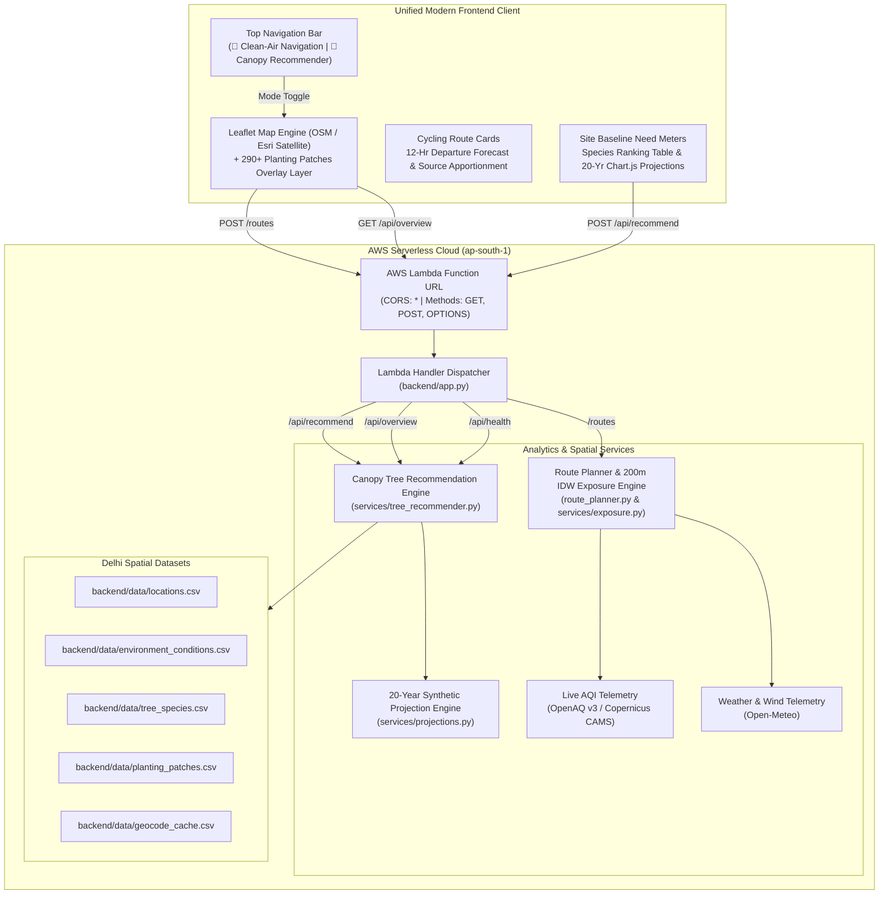

# Breathe Route & Canopy 🚲🍃🌳
> **Unified Clean-Air Cycling Navigation & Urban Forestry Intelligence for Delhi NCR**  
> *Built for Environmental Hacks by AWS × WeMakeDevs (Air Track)*

[](https://aws.amazon.com/serverless/sam/)
[](https://www.python.org/)
[](https://leafletjs.com/)
[](https://www.chartjs.org/)
[](https://opensource.org/licenses/MIT)

---

## 🎯 The Unified Mission & Real-World Impact

Delhi NCR faces dual compounding atmospheric and environmental crises: **toxic ambient particulate pollution (PM2.5)** and **extreme urban heat island stress**.

Conventional mapping tools optimize only for the fastest travel time, routing cyclists and delivery riders through toxic vehicle emission hotspots (Ring Road, ITO, CP circles). At the same time, municipal tree planting initiatives frequently select sapling species arbitrarily without grounding plans in local environmental baseline data, species particulate capture efficacy, heat mitigation, or water requirements.

**Breathe Route & Canopy merges both systems into a single, cohesive, high-impact environmental intelligence platform**:

1. **🚴 Clean-Air Cycling Navigation Engine (Breathe Route)**:
   - Evaluates alternative cycling corridors between any points in Delhi NCR.
   - Calculates length-weighted **PM2.5 exposure scores** using 200m Inverse-Distance Weighting (IDW) sampled from real-time monitoring stations.
   - Presents transparent trade-offs: `"+2 min, 18% less pollution exposure"`.
   - Computes a predictive **Best Time to Leave** 12-hour departure forecast and empirical **Particulate Source Likelihood** (vehicular exhaust, road dust, biomass smoke).

2. **🌳 Urban Forestry Recommender Engine (Canopy)**:
   - Matches any place or coordinate to nearest microclimate study sites (Anand Lok, Wazirpur, Sec-51 Gurugram).
   - Establishes seasonal baseline pressures (particulate burden, heat index &ge; 35 °C hours, VPD, rainfall).
   - Ranks optimal tree species on a multi-criteria 0–100 fit score (particulate capture, canopy cooling, drought resilience, local suitability, ozone/BVOC penalty).
   - Allocates trees across 290+ urban planting patches with diversity caps, and computes **20-year growth curves, canopy shade (m²), sapling survival, PM2.5 capture (kg), and costs (INR)** visualized via interactive Chart.js graphs.

---

## 🎨 Modernized User Experience & Motion Design

The interface was redesigned to eliminate cluttered/crowded layouts and provide a clean, modern, responsive web application while strictly preserving the signature **AWS Navy & Amazon Orange / Nature Green** color palette:

- **Refined Typography & Spacing Hierarchy**: Powered by *Plus Jakarta Sans* for crisp, modern headings, *Inter* for legible data reads, and *Roboto Mono* for precise telemetry values.
- **Micro-Interactions & Fluid Animations**:
  - **Entrance Motion**: Soft `fadeInUp` and `fadeInScale` animations for navigation cards and sidebars upon initial load.
  - **Card Hover Elevation**: Staggered cards with subtle vertical lift (`translateY(-2px)`), enhanced soft shadows, and click depression feedback.
  - **Animated Metric Bars**: Fluid cubic-bezier transitions (`transition: width 0.7s cubic-bezier(0.16, 1, 0.3, 1)`) for environmental stress factors and pollutant source percentages.
  - **Ambient Pulse Indicators**: Subtle pulsing glow animations for live station status indicators.
- **Glassmorphic Floating HUD**: The map controls, layer selectors (Streets vs. Esri Satellite), telemetry HUD, and patch legends feature modern frosted glass styling (`backdrop-filter: blur(8px)`).
- **Interactive Map Layers**: Toggle between Streets and Satellite imagery, or enable the **🌳 Planting Patches** layer to view and click any of the 290+ planting spaces in Delhi to instantly load tree recommendations.

---

## 🏗️ System Architecture



---

## 🔒 Hard Requirements & AWS Free Tier Compliance

1. **AWS Serverless**:
   - Built on **AWS SAM** (`template.yaml`) and **AWS Lambda** (Python 3.12, 512MB RAM).
   - Uses **Lambda Function URLs** with native CORS enabled (`GET, POST, OPTIONS`), bypassing Amazon API Gateway costs and operating 100% within the **AWS Free Tier** (1,000,000 free requests/month forever).
2. **Real-World Live Data (Zero Faked Values)**:
   - Navigation pulls real-time weather vectors and atmospheric particulate levels from Open-Meteo, Copernicus CAMS, and OpenAQ v3 CPCB stations.
   - Urban forestry engine is backed by multi-year environmental time series and validated Indian forestry parameters.

---

## 📊 Scientific Methodology & Mathematical Model

### 1. Route Discretization
Given a route polyline with coordinates $P_1, P_2, \dots, P_n$, the polyline is walked and interpolated every $s = 200\text{ meters}$:
$$\text{Sampled Waypoints } = \{W_1, W_2, \dots, W_k\}$$

### 2. Inverse-Distance Weighting (IDW)
At each 200m waypoint $W_j(\text{lat}, \text{lng})$, the estimated $\widehat{\text{PM}}_{2.5}$ concentration is calculated from all active Delhi monitoring stations $S_i$ located at distance $d(W_j, S_i)$ kilometers:

$$w_i = \frac{1}{d(W_j, S_i)^2 + \epsilon} \quad (\epsilon = 0.05 \text{ km})$$

$$\widehat{\text{PM}}_{2.5}(W_j) = \frac{\sum_{i=1}^{M} w_i \cdot \text{PM}_{2.5}(S_i)}{\sum_{i=1}^{M} w_i}$$

### 3. Route Exposure Score
The overall exposure score is the length-weighted mean across all equidistant 200m samples:
$$\text{Exposure Score} = \frac{1}{k} \sum_{j=1}^{k} \widehat{\text{PM}}_{2.5}(W_j)$$

### 4. Transparent Scientific Limitations
- **Station Density**: Official CPCB/OpenAQ monitoring stations are distributed across Delhi at ~5–10 km intervals. While IDW provides continuous macro-interpolation, local street-level microclimates (e.g. idling trucks at red lights) can create hyper-local spikes.
- **Model Disclaimer**: All route scores and departure timelines are clearly labeled in the user interface as mathematical estimates.

---

## 📡 Unified API Contract

| Endpoint | Method | Description |
|---|---|---|
| `/routes` | `POST` | Calculate cycling routes, PM2.5 exposure scores, departure forecast, and source likelihood |
| `/api/overview` | `GET` | Catalog of study sites and 290+ urban planting patches for Delhi map overlay |
| `/api/recommend` | `POST` | Environmental baseline, species fit ranking, patch allocation, and 20-year projection curves |
| `/api/health` | `GET` | Service status, study sites count, and botanical species catalog count |

### 1. `POST /routes` (Navigation Request)
```json
{
  "start": { "lat": 28.6328, "lng": 77.2197 },
  "end": { "lat": 28.6129, "lng": 77.2295 },
  "mode": "cycling"
}
```

### 2. `POST /api/recommend` (Tree Recommendation Request)
```json
{
  "query": "Anand Lok, New Delhi",
  "top_k": 6
}
```
*Or via coordinates:*
```json
{
  "lat": 28.5587,
  "lon": 77.21886,
  "top_k": 6
}
```

### Sample Response (`POST /api/recommend`):
```json
{
  "result": {
    "matched_location": { "name": "Anand Lok", "distance_km": 0.1 },
    "needs": { "pm_need": 0.82, "heat_need": 0.74, "water_scarcity": 0.51, "waterlogging_risk": 0.35 },
    "species_ranking": [
      { "species_id": "NEEM", "common_name": "Neem", "score": 70.8, "pm25_removal_g_yr_mature_local": 983 },
      { "species_id": "IMLI", "common_name": "Imli", "score": 68.4, "pm25_removal_g_yr_mature_local": 845 }
    ],
    "plan_summary": { "trees": 793, "pm25_g_yr_mature": 305727, "cost_7yr_inr": 3885605 }
  },
  "table": [ ... ],
  "projection": {
    "years": [0, 1, 2, ..., 20],
    "species": [ ... ],
    "totals": {
      "annual_cost": [ ... ],
      "cum_cost": [ ... ],
      "pm25_cum_kg": [ ... ],
      "shade_m2": [ ... ]
    }
  }
}
```

---

## 🚀 Quickstart & Local Setup Guide

### 1. Requirements & Dependencies
- Python 3.10+
- Install dependencies:
```bash
pip install pandas numpy requests
```

### 2. Run Unified Automated Verification Tests
Run the comprehensive test suite validating all 5 unified API routes:
```bash
python backend/tests/test_unified_app.py
```
Expected output:
```text
======================================================================
   TESTING UNIFIED BREATHE ROUTE & CANOPY TREE RECOMMENDER
======================================================================
[1/5] Testing OPTIONS Preflight... -> OK
[2/5] Testing GET /api/health... -> OK
[3/5] Testing GET /api/overview... -> OK (3 sites, 293 patches)
[4/5] Testing POST /api/recommend... -> OK (Matched: Anand Lok, 793 trees)
[5/5] Testing POST /routes... -> OK (3 routes evaluated)
======================================================================
  [SUCCESS] All 5 unified API routes passed successfully!
======================================================================
```

### 3. Run Locally (Unified Web App)
Start the unified local development server (serves the animated frontend UI on root and all backend API endpoints):
```bash
python backend/local_server.py 8000
```
Open **`http://127.0.0.1:8000`** in your browser.

- Use the top navigation bar to switch between **🚴 Clean-Air Navigation** and **🌳 Canopy Tree Recommender**.
- In Navigation mode, select presets (e.g. *CP ➔ India Gate*) or click any two points on the map.
- In Canopy mode, click landmark chips (*Anand Lok*, *Wazirpur*, *Sec-51 Gurugram*) or paste coordinates.
- In the top-left map controls, toggle between **Streets** and **Satellite** views or enable **🌳 Planting Patches** to inspect and click planting spaces on the map.
- Export results anytime using the **Download JSON** or **Download GeoJSON** buttons.

---

## ☁️ Deploy to AWS with SAM

### Prerequisites
- [AWS CLI](https://aws.amazon.com/cli/) (`aws configure` run with your credentials)
- [AWS SAM CLI](https://aws.amazon.com/serverless/sam/)

### Build and Deploy:
```bash
# 1. Build the zero-dependency SAM application
sam build

# 2. Deploy guided to AWS (Asia Pacific - Mumbai)
sam deploy --guided
```

When prompted:
- **Stack Name**: `breathe-route`
- **AWS Region**: `ap-south-1`
- **Allow SAM CLI to create IAM roles**: `Y`


- **BreatheRouteFunction Function URL may not have authorization defined**: `y` (public endpoint)

Copy the printed `BreatheRouteFunctionUrl` output and update `DEFAULT_API_URL` in `frontend/app.js`.

---

## 👥 Contributors & Acknowledgements

- Developed for **Environmental Hacks by AWS × WeMakeDevs** (Air Track).
- Environmental telemetry: **OpenAQ v3**, **Open-Meteo**, **Copernicus CAMS European Earth Observation**, and **OpenStreetMap Contributors**.
- vanshika
- navya
