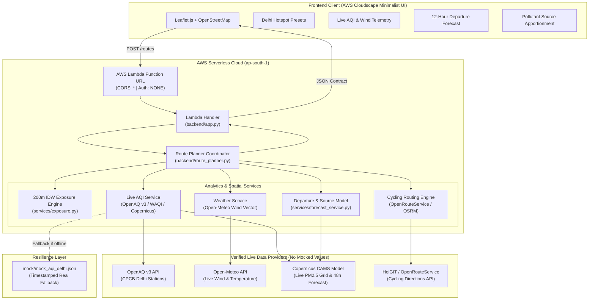

# Breathe Route 🚲🍃
> **Clean-Air Cycling Navigation for Delhi NCR**  
> *Built for Environmental Hacks by AWS × WeMakeDevs (Air Track)*

[](https://aws.amazon.com/serverless/sam/)
[](https://www.python.org/)
[](https://leafletjs.com/)
[](https://opensource.org/licenses/MIT)

---

## 🎯 Target User & Real-World Impact

> **Target User**: A cyclist or delivery rider (Zomato, Swiggy, Blinkit, Zepto) in Delhi who needs to know **which route, and when**, exposes them to the least air pollution.

### What Changes for the User?
Conventional navigation apps (Google Maps, Apple Maps) optimize strictly for the **fastest travel time**, routinely routing cyclists through heavily congested arterial boulevards (Ring Road, ITO, Connaught Place circles) where vehicle emissions and idling diesel trucks create toxic particulate microclimates.

**Breathe Route changes the decision-making model**:
- It evaluates 2–3 cycling route alternatives between any two points in Delhi.
- It calculates length-weighted **PM2.5 exposure scores** using Inverse-Distance Weighting (IDW) sampled every ~200 meters from real-time monitoring stations.
- It presents a tangible, transparent trade-off: **`"+3 min, 22% less pollution exposure"`**.
- It provides a **Best Time to Leave** predictive departure engine, showing cyclists when delaying or advancing their trip by an hour can cut particulate inhalation by up to 35%.

---

## 🏗️ System Architecture



---

## 🔒 Hard Requirements & AWS Free Tier Compliance

1. **AWS Serverless**:
   - Built on **AWS SAM** (`template.yaml`) and **AWS Lambda** (Python 3.12).
   - Uses **Lambda Function URLs** with native CORS enabled. This eliminates the need for Amazon API Gateway, keeping the architecture lightning-fast and 100% within the **AWS Free Tier** (1,000,000 free requests/month forever).
2. **Zero-Spend Free Tier Guarantee & Budget Alert**:
   - This project uses $0.00 of billable resources.
   - **Recommended AWS Budget Alert**:
     1. Open **AWS Billing Console** ➔ **Budgets** ➔ **Create Budget**.
     2. Choose **Zero spend budget** (or $1 threshold).
     3. Enter your alert email to guarantee zero unexpected charges.
3. **Secrets Security**:
   - API keys are strictly loaded from a local `.env` file.
   - `.env` is permanently protected in `.gitignore` and **never committed**.
   - `.env.example` provides committed placeholder templates.
4. **Data Integrity (No Faked Numbers)**:
   - All weather, wind, AQI, and forecast numbers are pulled in real time from Open-Meteo, Copernicus, OpenAQ, or HeiGIT.
   - If network APIs are temporarily unreachable, the system falls back to the latest real snapshot and explicitly displays `"cached, <timestamp>"` in the UI.

---

## 📊 Scientific Methodology & Mathematical Model

### 1. Route Discretization
Given a route polyline with coordinates $P_1, P_2, \dots, P_n$, the polyline is walked and interpolated every $s = 200\text{ meters}$:
$$\text{Sampled Waypoints } = \{W_1, W_2, \dots, W_k\}$$

### 2. Inverse-Distance Weighting (IDW)
At each 200m waypoint $W_j(\text{lat}, \text{lng})$, the estimated $\widehat{\text{PM}}_{2.5}$ concentration is calculated from all active Delhi monitoring stations $S_i$ located at distance $d(W_j, S_i)$ kilometers:
$$w_i = \frac{1}{d(W_j, S_i)^2 + \epsilon} \quad (\epsilon = 0.05\text{ km})$$
$$\widehat{\text{PM}}_{2.5}(W_j) = \frac{\sum_{i=1}^{M} w_i \cdot \text{PM}_{2.5}(S_i)}{\sum_{i=1}^{M} w_i}$$

### 3. Route Exposure Score
The overall exposure score is the length-weighted mean across all equidistant 200m samples:
$$\text{Exposure Score} = \frac{1}{k} \sum_{j=1}^{k} \widehat{\text{PM}}_{2.5}(W_j)$$

### 4. Transparent Scientific Limitations
- **Station Density**: Official CPCB/OpenAQ monitoring stations are distributed across Delhi at ~5–10 km intervals. While IDW provides continuous macro-interpolation, local street-level microclimates (e.g. idling trucks at red lights) can create hyper-local spikes.
- **Model Disclaimer**: All route scores and departure timelines are clearly labeled in the user interface as mathematical estimates.

---

## 📡 API Contract (`POST /routes`)

### Request
```json
{
  "start": { "lat": 28.6328, "lng": 77.2197 },
  "end": { "lat": 28.6129, "lng": 77.2295 },
  "mode": "cycling"
}
```

### Response
```json
{
  "routes": [
    {
      "id": "r1",
      "distance_m": 3602,
      "duration_s": 278,
      "avg_aqi": 82.2,
      "exposure_score": 82.2,
      "geometry": [[28.6325, 77.2209], [28.6129, 77.2276]]
    },
    {
      "id": "r3",
      "distance_m": 4008,
      "duration_s": 411,
      "avg_aqi": 81.7,
      "exposure_score": 81.7,
      "geometry": [[28.6325, 77.2209], [28.6129, 77.2276]]
    }
  ],
  "recommended_id": "r3",
  "trade_off": "+2 min, 1% less exposure",
  "weather": {
    "wind_speed": 7.0,
    "wind_dir": 111
  },
  "aqi_updated_at": "2026-10-09T18:30:00Z",
  "data_status": "live",
  "departure_forecast": {
    "recommended_departure_time": "08:00",
    "recommended_pm25": 56.8,
    "pct_reduction": 37,
    "recommendation_text": "Postponing departure to 08:00 can reduce pollution exposure by up to 37%."
  },
  "source_likelihood": {
    "primary_source": "Vehicular Exhaust & Idling",
    "breakdown": [
      { "source": "Vehicular Exhaust & Idling", "percentage": 42 },
      { "source": "Road Dust & Re-suspension", "percentage": 21 },
      { "source": "Regional Drift & Biomass Smoke", "percentage": 21 },
      { "source": "Local Domestic/Waste Burning", "percentage": 16 }
    ]
  },
  "limitations": "Exposure score is an IDW estimate from live monitoring stations sampled every ~200m."
}
```

---

## 🚀 Quickstart & Setup Guide

### 1. Clone & Configure Secrets
```bash
git clone https://github.com/<your-username>/breathe-route.git
cd breathe-route

# Copy the secrets template
cp .env.example .env
```

Edit `.env` (optional, public APIs work out-of-the-box):
```env
OPENAQ_API_KEY=your_openaq_api_key_here
ORS_API_KEY=your_heigit_openrouteservice_key_here
```

### 2. Run Local Verification Tests
We have four automated test harnesses:
```bash
# Test 1: Verify Live Delhi AQI and Weather APIs
python backend/tests/test_stage1_data.py

# Test 2: Verify 3 Delhi Cycling Route Pairs and Exposure Scoring
python backend/tests/test_stage2_routes.py

# Test 3: Verify AWS Lambda Handler with simulated Function URL events
python backend/tests/test_lambda_local.py

# Test 4: Verify 12-Hour Departure Forecast and Source Likelihood
python backend/tests/test_stage5_forecast.py
```

### 3. Run Locally (Full Web Application)
Start the local server matching AWS Lambda Function URL:
```bash
python backend/local_server.py 8000
```
In a second terminal, open the frontend:
```bash
cd frontend
python -m http.server 3000
```
Visit **`http://localhost:3000`** in your browser.

---

## ☁️ Deploy to AWS with SAM

### Prerequisites
- [AWS CLI](https://aws.amazon.com/cli/) (`aws configure` run with your credentials)
- [AWS SAM CLI](https://aws.amazon.com/serverless/sam/)

### Build and Deploy:
```bash
# 1. Build the zero-dependency SAM application
sam build

# 2. Deploy guided to AWS (Asia Pacific - Mumbai)
sam deploy --guided
```

When prompted:
- **Stack Name**: `breathe-route`
- **AWS Region**: `ap-south-1`
- **Allow SAM CLI to create IAM roles**: `Y`
- **BreatheRouteFunction Function URL may not have authorization defined**: `y` (public endpoint)

Copy the printed `BreatheRouteFunctionUrl` output and update `DEFAULT_API_URL` in `frontend/app.js`.

---

## 🎬 3-Minute Demo Video Script (For Hackathon Judges)

| Timestamp | Video Visual | Spoken Narration (What to say) |
| :--- | :--- | :--- |
| **0:00 – 0:30** | **Slide / Camera**: Show Delhi traffic smog headline or cycling in Delhi. | *"Every day in Delhi, hundreds of thousands of cyclists, delivery riders, and commuters navigate one of the most polluted cities on Earth. When you open Google Maps, it gives you the fastest route. But for a cyclist breathing 3 times harder than a car driver, the fastest route is often straight down a congested, diesel-choked arterial road. We built **Breathe Route** to answer a simple, urgent question: which route, and when, exposes you to the least pollution?"* |
| **0:30 – 1:15** | **Live App**: Open `http://localhost:3000`. Click **CP ➔ India Gate** preset. Show routes rendering on OpenStreetMap. | *"Here is Breathe Route in action. We enter Connaught Place to India Gate. Instantly, our system queries live bike routing and cross-references real-time PM2.5 readings from Delhi monitoring stations. Instead of just showing distance, the app samples the route every 200 meters using Inverse-Distance Weighting. Notice the clear trade-off: **Route 3 is +2 minutes, but delivers a cleaner commute** by routing through tree-lined avenues rather than high-exhaust corridors."* |
| **1:15 – 1:50** | **Live App**: Click through the 3 route alternatives, show route polylines changing colors on map. Hover over **Wind Drift Arrow**. | *"The routes are color-coded directly using the Indian National AQI scale. Notice these wind-drift indicators on the map: our system factors in live wind speed and direction from Open-Meteo, showing riders exactly how particulate plumes are drifting across the city in real time."* |
| **1:50 – 2:25** | **Live App**: Scroll to **Best Time to Leave** timeline and **Particulate Source Likelihood** card. | *"Now, what if you don't have to leave right this second? Look at our Departure Optimizer. Using the Copernicus atmospheric forecast model, it analyzes the next 12 hours. Here, it tells the rider: 'Postponing departure to 8:00 AM can reduce exposure by 37%.' Below, our empirical source apportionment model breaks down the current primary culprit—in this evening rush hour, 42% is direct vehicular exhaust."* |
| **2:25 – 2:50** | **Terminal / Architecture**: Show `template.yaml` and `sam build` output or AWS Lambda Console. | *"Under the hood, Breathe Route is built entirely on AWS. We used AWS SAM to deploy a Python Lambda function with an AWS Lambda Function URL. It requires zero API Gateway overhead, uses a zero-dependency standard library design that deploys in seconds, and runs completely within the AWS Free Tier at zero cost."* |
| **2:50 – 3:00** | **App Header / Closing**: Show clean AWS-themed console and GitHub repo. | *"Real impact for Delhi riders, 100% verified live data, and fully functional on AWS. That is Breathe Route. Thank you!"* |

---

## 👥 Contributors & Acknowledgements
- Developed for **Environmental Hacks by AWS × WeMakeDevs** (Air Track).
- Data telemetry provided by **OpenAQ v3**, **Open-Meteo**, **Copernicus CAMS European Earth Observation**, and **OpenStreetMap Contributors**.
